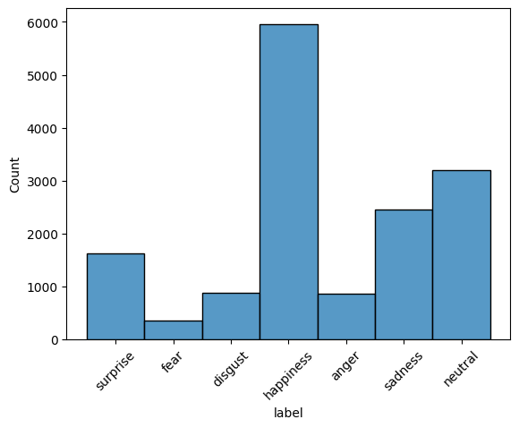
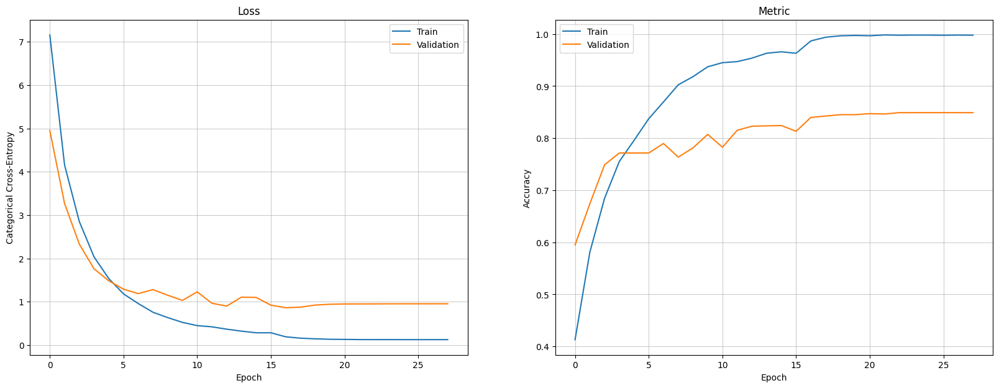

# Human Facial Emotion Recognition (HFER)

## Introduction
HFER is a Python project that leverages convolutional neural network to detect emotions from human faces which are extracted from images uploaded by a user. It can recognize the following seven emotions: surprise, fear, disgust, happiness, anger, sadness, and neutral. We used multiclass image classification, a type of supervised deep learning algorithm.

## Usage
### REST API
HFER's REST API was written using FastAPI and the container has been deployed on Google Cloud Run which can be accessed [here](https://hfer-api-3s6mpd7w3q-uw.a.run.app/).

**Note:** Cold starts are enabled by default on GCR, so the container may take up to a few minutes to start the first time it is accessed.

#### How to use the API
<details>
<summary>❗️❗️❗️ TO DO ❗️❗️❗️</summary>
Step-by-step guide to using the API and a link to the API documentation once generated
</details>

### Web UI
HFER has a web interface written using Streamlit. The code resides in its own separate repo [here](https://github.com/facial-emotion-recognition-service/hfer_front). It is currently deployed [here](https://hfer-farid-nathan.streamlit.app/).

## Installation (For Development):
### Install Locally
1. Clone the repo.
2. Download the trained model file [here](https://drive.google.com/file/d/1EXQdc-XM1vzkO4KLeSbUMfJk9w-rvehG/view?usp=drive_link) and copy it into the `models` directory.
3. Install the `hfer` package in editable mode with:
   ``` bash
   pip install -e .
   ```
4. From the `hfer/hfer` directory run:
   ``` bash
   uvicorn hfer.server.main_server:app --reload
   ```
### Install Using Docker
1. Follow steps 1-2 above.
2. Build the docker image with:
   ``` bash
   docker build -t hfer-api .
   ```
3. Run the container with:
   ``` bash
   docker run -p 8000:8000 hfer-api
   ```

> **Note:** If you would like to deploy the front-end locally as well, follow the instructions in the [`hfer_front` repo](https://github.com/facial-emotion-recognition-service/hfer_front)'s README.

## Training Data
We trained our model on a subset of the Real-world Affective Faces Database (RAF-DB) data set with around 15,000 faces each labeled with a single emotion from this list of seven emotions: surprise, fear, disgust, happiness, anger, sadness, and neutral. We used 80% of the consolidated and randomized data for training, 10% for validation and 10% for testing.

As can be seen in the chart below, the data is heavily skewed. We have not yet tried any techniques (e.g. augmentation, under/over-sampling) for balancing the classes labels.


See [here](https://paperswithcode.com/dataset/raf-db) and [here](https://www.kaggle.com/datasets/shuvoalok/raf-db-dataset/data) for further information about the original dataset.

## Architecture
### The Machine Learning Model
We use TensorFlow Keras to fine-tune a pre-trained [DenseNet121](https://keras.io/api/applications/densenet/) with Imagenet weights. We use the pretrained weights as 'initial weights' and do not "freeze" any layers. We add a "head" with two fully-connected hidden layers (with 512 and 256 neurons respectively, and ReLU activation functions). We also utilize L2 regularizers and dropout regularization layers in both hidden layers. The entire model has roughly 32.8 million trainable parameters. Finally, we use [`ReduceLROnPlateau`](https://keras.io/api/callbacks/reduce_lr_on_plateau/) and an [`EarlyStopping`](https://keras.io/api/callbacks/early_stopping/) callbacks during training.

Before arriving at the above architecture (our best-performing to date), we experimented quite a lot with:
- various pre-trained models (VGG-16, ResNets, DenseNets),
- various regularization hyperparameters,
- various learning rates and LR reduction regimes,
- various model "head" architectures (# hidden layers and # neurons in each),
- various activation functions in the hidden layers, and
- "freezing" varying portions of the pre-trained model.

<details>
<summary>TO DO: Everything else</summary>

### REST API
FastAPI

### Web Front-End
Streamlit
</details>

## Model Performance
The model reached an accuracy score of **~82.5% on the test set** and ~85% on the validation set:


The confusion matrix (below) shows the breakdown of precision, recall and F1 scores per class label. Not surprisingly, the model performs relatively poorly on "disgust" and "fear", two classes of emotions for which it has not encountered as many examples as the other labels. (Although it performs much better on "anger" which had about as many training examples as "disgust".)
```
              precision    recall  f1-score   support

    surprise       0.84      0.83      0.84       155
        fear       0.72      0.54      0.62        39
     disgust       0.56      0.41      0.48        82
   happiness       0.93      0.94      0.94       631
       anger       0.80      0.72      0.76        82
     sadness       0.79      0.71      0.75       241
     neutral       0.74      0.85      0.79       301

   micro avg       0.83      0.82      0.83      1531
   macro avg       0.77      0.71      0.74      1531
weighted avg       0.83      0.82      0.83      1531
 samples avg       0.82      0.82      0.82      1531
```
<details>
<summary>TO DO: Comments and charts on the accuracy/precision/recall/F1 score, etc.</summary>
</details>

## Contributors
HFER was developed by two friends, Farid and Nathan, with significant input and guidance from a third friend: Or. The initial target architecure (led by Or) followed a "microservices" model and was meant to be deployed on GCP using Kubernetes. When Or had to reduce his involvement in the project due to other commitments, Nathan and Farid decided to significantly simplify the architecture to the form it is in now.
